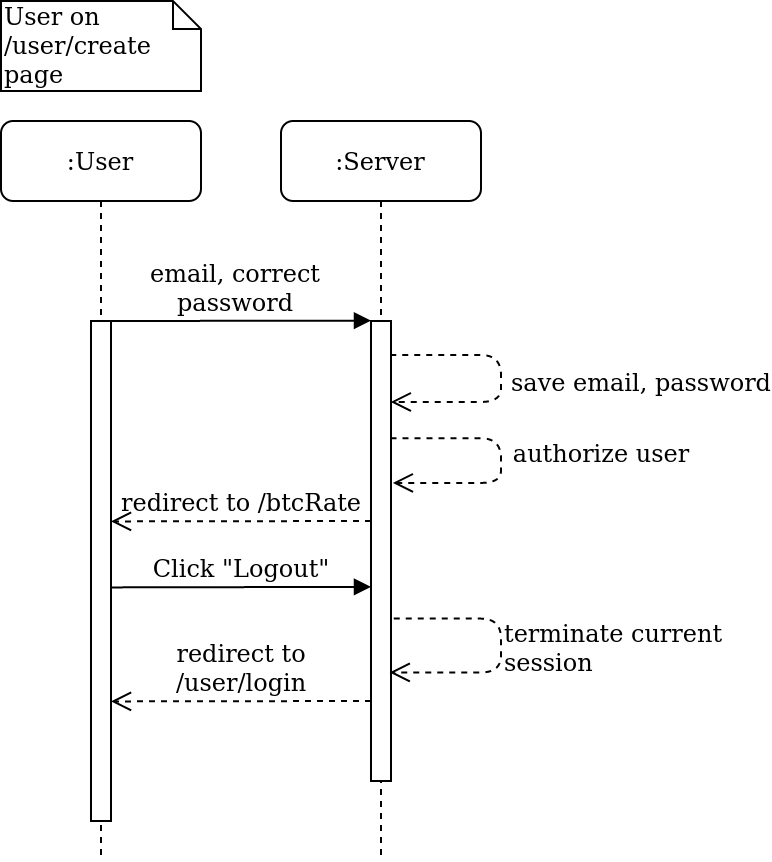

# SESCase
## Genesis Software Engineering School test case

_P.S. Project was tested on PHP test server on linux.
Some unexpected errors related to server configs may appear._

### Task:
Develop Web API which show BTC rate in UAH for authorized persons.

### Description:
Here's Web API which shows BTC rate in UAH from <a href="https://bitpay.com">bitpay.com</a>.
In current solution presented opportunities to create account,
login and logout which is done by session mechanism in PHP.

### Possible scenarios:

 - Registered user wants to know current BTC rate: 
   
 - Unregistered user wants to know current BTC rate: 
   